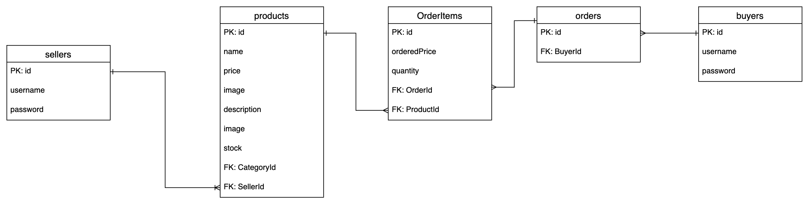

# Why

This repo provides the APIs of [e-commerce website](https://github.com/Fan-55/tc-front).

# ERD



# How to start

1. Set the following environment variables
```
DB_HOST=<host of mysql>
DB_NAME=<name of database>
DB_TYPE="mysql"
DB_USERNAME=<username of mysql>
DB_PASSWORD=<password of mysql>
TOKEN_SIGNING_KEY=<key for token>
```

2. Run database migrations
```
npx sequelize-cli db:migrate
```

3. Run seeders
```
npx sequelize-cli db:seed:all
```

4. Execute following commands
```
npm install
npm start
```
